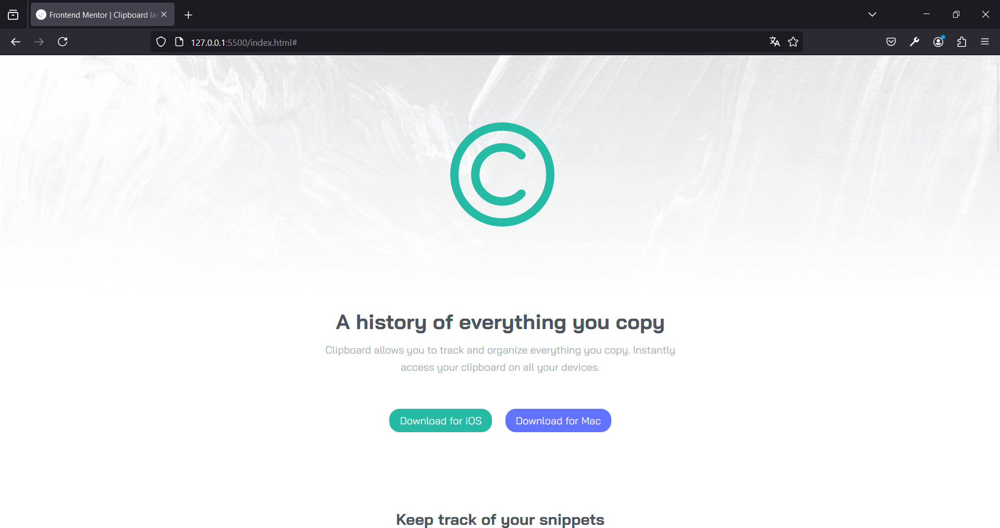

# Frontend Mentor - Clipboard landing page solution

This is a solution to the [Clipboard landing page challenge on Frontend Mentor](https://www.frontendmentor.io/challenges/clipboard-landing-page-5cc9bccd6c4c91111378ecb9). Frontend Mentor challenges help you improve your coding skills by building realistic projects. 

## Table of contents

- [Overview](#overview)
  - [The challenge](#the-challenge)
  - [Screenshot](#screenshot)
  - [Links](#links)
- [My process](#my-process)
  - [Built with](#built-with)
  - [What I learned](#what-i-learned)
  - [Continued development](#continued-development)
  - [Useful resources](#useful-resources)
- [Author](#author)

## Overview

### The challenge

Users should be able to:

- View the optimal layout for the site depending on their device's screen size
- See hover states for all interactive elements on the page

### Screenshot



### Links

- Solution URL: [Add solution URL here]
- Live Site URL: [https://clipboarding-pag-albertovama.netlify.app]

## My process

### Built with

- Semantic HTML5 markup
- CSS custom properties
- Flexbox


### What I learned

```html
<h1>Some HTML code I'm proud of</h1>
    <div class="workflow">
      <div class="workflow__heading">
        <h2>Supercharge your workflow</h2>
        <p>We’ve got the tools to boost your productivity.</p>
      </div>

      <div class="workflow__data">
        <div class="CB">
          
          <h3>Create blacklists</h3>
          <p>Ensure sensitive information never makes <span class="salto"> its way to your Clipboard by excluding certain <span class="salto"></span> sources.</p>
        </div>

        <div class="PTS">
          
          <h3>Plain text snippets</h3>
          <p>Remove unwanted formatting from copied text <span class="salto"> for a consistent look.</p>
        </div>

        <div class="SP">
          
          <h3>Sneak preview</h3>
          <p>  Quick preview of all snippets on your Clipboard <span class="salto"> for easy access.</p>
        </div>
      </div> <!-- WORK DATA -->
    </div> <!-- WORKFLOW -->
```
```css
.proud-of-this-css {
  .snippets__data img{
    position: relative;
    left: -5%;
    width: 45rem;
}
}
```
```js
const proudOfThisFunc = () => {
  console.log('🎉')
}
```


### Continued development

Im keeping focusing in this tasks. Front End is a branch that i love and i want to job for this.

**Note: Delete this note and the content within this section and replace with your own plans for continued development.**

### Useful resources

- [HTML SNIPPET](https://www.paulirish.com/2012/box-sizing-border-box-ftw/) - This helps to converts 1rem = 10px,

## Author

- Frontend Mentor - [@AlbertoVaMa](https://www.frontendmentor.io/profile/yourusername)
- Twitter - [@Betungas18](https://www.twitter.com/yourusername)


